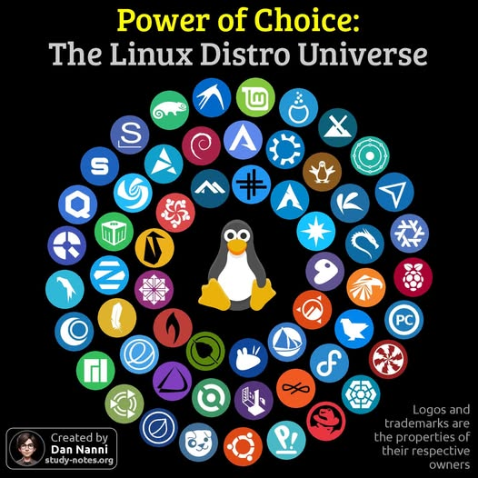
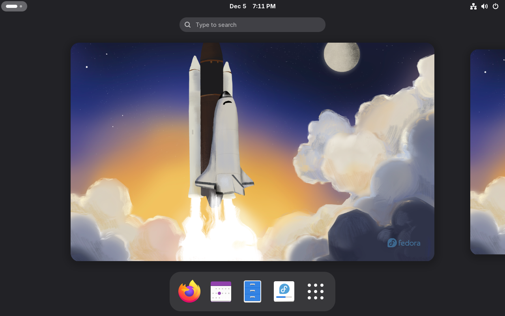
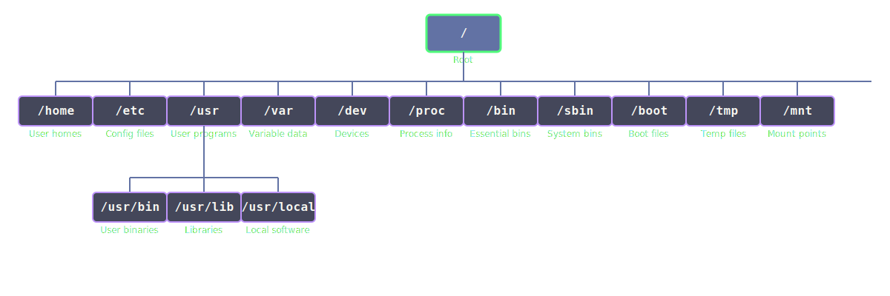

<!-- _class: intro -->

# An Introduction to Linux
## The how and why of Linux


---

## Welcome!

**Quick poll:**
- Who uses Linux at home? At work?
- What do you want to learn today?

<!-- **Set expectations:**
- Interactive, casual, fast-paced intro -->

---

<!-- _class: lead -->
# Why Linux?

---

## Why Linux: Freedom & Control

- **Open source** → transparency, privacy, customization
- Efficient on old/new hardware
- Inexpensive - no license fees

**Discussion prompt:** What are your favorite things about Linux?

---

## Why Linux: Stability & Security

- Strong permission model
- Regular, predictable updates
- Built for multi-user environments

---

## Why Linux: Ecosystem & Variety

- Distros for all experience levels
- Desktop environments and their workflows

---



---

## Why Linux: Real-World Use Cases

- Development
- Servers
- Embedded systems
- Creative work
- Gaming

---

<!-- _class: lead -->
# Getting Started – Installation

---

## Choosing a Beginner-Friendly Distro

Popular choices:
- Ubuntu
- Mint
- Fedora
- Pop!_OS
- CentOS/RHEL/Alma

What are you using and why?

<!-- **Ask attendees for their recommendations** -->

---

## Installation Overview

**Live USB → Install Wizard**

1. ISO → USB tool
2. "Try" vs "Install"
3. Automatic partitioning
4. Encryption option
5. "fedora-media-writer" is your friend (easy button)

---

## Dual-Boot Considerations

- UEFI/Secure Boot
- The "grub" challenge
- It's easier to just use VMs than messing with dual-boot

---

<!-- _class: lead -->
# Linux: Core Concepts

---

## GUI Overview

**Desktop Environments**
- GNOME, KDE, XFCE
- What changes and what doesn't when switching DEs

**Common System Tools**

<div class="columns">
<div>

- File managers
- Settings menu

</div>
<div>

- Software center
- GUI update tools

</div>
</div>

<!-- **Activity:** Browse system settings -->

---



---

## Filesystem Hierarchy Standard



---

## Filesystem Hierarchy Standard cont.

**Key Directories**
- `/` - Root directory
- `/home` - User home directories
- `/etc` - Configuration files
- `/usr/bin` - User binaries
- `/var` - Variable data
- `/dev` - Device files
- `/proc` - Process information
- `/mnt` - Mount points

<!-- Demo - show live on a system -->
---

## Special system directories
**Kernel information**
- `/proc` - Process information and more
- `/sys` - Hardware device information/configuration
- `/dev` - Linux device nodes
- `/run` - Runtime "temporary" files (pid files etc)

---

## Filesystem Hierarchy Standard (cont.)

**Key Concepts:**
- Case sensitivity
- Everything is a file
- Configs = plain text

<!-- **Activity:** Look around `/etc` or home directory via GUI -->

---

## Your $HOME on Linux

- It's where YOUR files are stored
- `/home` is typically a separate mount point
- `/home` holds the content of ALL user files of the system (not just a single user)
- `/home/peter` is the home directory for the user "peter"
- KEY DIRECTORY FOR BACKUP!

---

## Basic Networking with NetworkManager

**GUI:**
- Wi-Fi, wired, VPN
- DNS, IPv4/IPv6
- Connection profiles

---

## Basic Networking - CLI

**nmcli commands:**
```bash
nmcli device status
nmcli connection show
nmcli connection up <name>
```

**Troubleshooting tools:**
- `ping`
- `traceroute`
- `journalctl`

---

<!-- _class: lead -->
# Bash and Terminals
## Do not Be Afraid of the CLI

---

## Why the CLI is Still Important

- Scripting, speed, remote access, automation
- Tools and documentation assume CLI familiarity
- More control - lots of settings cannot be done using a GUI
- Servers do not have GUIs - waste of resources

---

## Beginner-Friendly Concepts

- **TAB completion** - Your best friend!
- **History** - Navigate previous commands
- **man pages** - Built-in documentation
- **/usr/share/doc** - Official upstream documentation

---

## Starter Commands

**Navigation & Files:**
```bash
ls, cd, pwd, mkdir
cp, mv, rm
```

**System Info:**
```bash
df -h        # Disk space
du -sh *     # Directory sizes
top / htop   # Process monitor
```

<!-- **Activity:** Run basics in the home directory -->

---

<!-- _class: lead -->
# Tips & Tools for Making Linux Easier

---

## Making Life Easier

- **GUI software managers** - Easy app installation
- **Backups** - Timeshift, Déjà Dup, btrfs snapshots
- **Troubleshooting habits** - Check logs, search forums
- **Community resources** - Forums, LUGs, IRC/Matrix

---

<!-- _class: lead -->
# Linux as a Career Skill

---

## Why IT Pros Need Linux Knowledge

**Servers run on Linux:** (The Internet runs on Linux!)
- Majority of cloud infrastructures (AWS, GCP, Azure, OCI)
- Enterprise servers, containers

**Networking equipment:**
- Often uses Linux under the hood
- Firewalls, routers, monitoring tools

---

## "Why": Outside of the datacenter
Linux is everywhere

- Smart TVs
- Mobile devices
- Embedded devices (fireTV etc)

---

## Why IT Pros Need Linux Knowledge (cont.)

<div class="columns">
<div>

**DevOps & SRE:**
- CI/CD pipelines
- Automation
- Infrastructure-as-Code

**Security careers:**
- Logs, permissions, systemd
- Kernel features, forensic tools

</div>
<div>

**Data centers & virtualization:**
- KVM, Proxmox, VMware integrations

</div>
</div>

---

## "Why": Job Roles That Benefit From Linux Skills

- System Administrator
- DevOps / Platform Engineer
- Network Engineer
- Site Reliability Engineer (SRE)
- Cybersecurity Analyst / Pentester
- Cloud Architect / Cloud Engineer
- Embedded / IoT developers

---

## How to Start Building Career-Ready Skills

- Run a local VM and break/fix it
- Learn `systemctl` basics
- Manage users/permissions
- Write small automation scripts
- Practice with containers (Podman, Docker)
- Use cloud free tiers (AWS free tier, etc.)

---

## Interactive Component

**Ask experienced members:**
- "How has Linux helped your career?"
- "What skills made the biggest difference?"

---

<!-- _class: lead -->
# Advanced User Nuggets

---

## For Experienced Attendees

- **Containers** - Podman/Docker
- **systemd basics** - `systemctl status`, logs via `journalctl`
- **Security technologies** - SELinux/AppArmor
- **Flatpak/AppImage** vs native packaging
- **SSH, NFS/Samba** sharing

---

<!-- _class: lead -->
# Q&A, Group Sharing, and Next Steps

---

<!-- _class: lead -->
# Thank You!

**What topics do you want next time**
